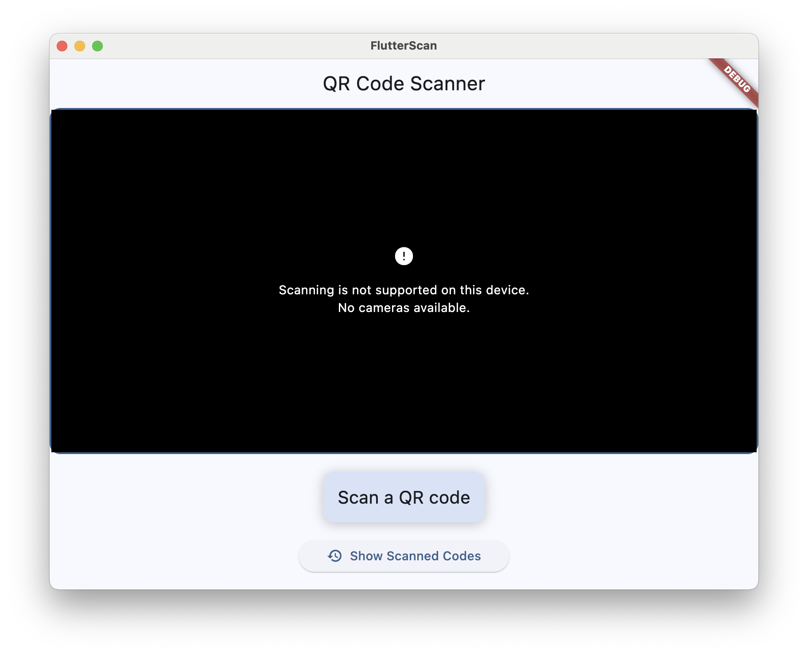

# QR Code Scanner App

A simple QR Code Scanner app built with Flutter. It uses the **mobile_scanner** package for scanning QR codes, **Hive** for local storage of scanned codes, and supports **Material 3** for a modern look. The app also provides feedback using **SnackBar** and supports dark mode.

## Features

- **QR Code Scanning**: Scan QR codes using the device's camera.
- **Save Scanned Data**: Automatically store scanned QR codes locally using Hive.
- **View Scanned History**: View a list of all previously scanned QR codes.
- **Feedback**: Haptic feedback on mobile devices when a QR code is scanned, and SnackBar feedback for all platforms.
- **Material 3**: Uses Material Design 3 (Material You) for theming and modern UI components.
- **Dark Mode Support**: Automatically adapts to the device's system settings for light/dark mode.

## Installation

1. Clone the repository:

    ```bash
    git clone https://github.com/iNoles/FlutterScan.git
    ```

2. Navigate to the project directory:

    ```bash
    cd FlutterScan
    ```

3. Install dependencies:

    ```bash
    flutter pub get
    ```

4. Run the app:

    ```bash
    flutter run
    ```

## Packages Used

- [**mobile_scanner**](https://pub.dev/packages/mobile_scanner): To scan QR codes using the device camera.
- [**hive_flutter**](https://pub.dev/packages/hive_flutter): For local storage of scanned QR codes.
- [**flutter_hive**](https://pub.dev/packages/hive): Lightweight key-value database for Flutter applications.
- [**flutter**](https://flutter.dev/): Framework for building cross-platform apps with a single codebase.

## How It Works

- The app opens a camera feed and continuously scans for QR codes using the **mobile_scanner** package.
- Once a QR code is detected, it triggers haptic feedback on mobile devices and shows a **SnackBar** message.
- The scanned QR code data is stored locally in a Hive box and can be viewed later in a list by clicking the "Show Scanned Codes" button.

## UI and Theming

- The app supports **Material 3** for its UI and theming.
- The theme adapts automatically to the system's dark or light mode settings.
- Both the light and dark themes use a seed color to generate the color palette for the app.

## ScreenShots



## Contributing

1. Fork the repository.
2. Create a new branch (`git checkout -b feature/your-feature`).
3. Commit your changes (`git commit -am 'Add some feature'`).
4. Push to the branch (`git push origin feature/your-feature`).
5. Create a new Pull Request.
